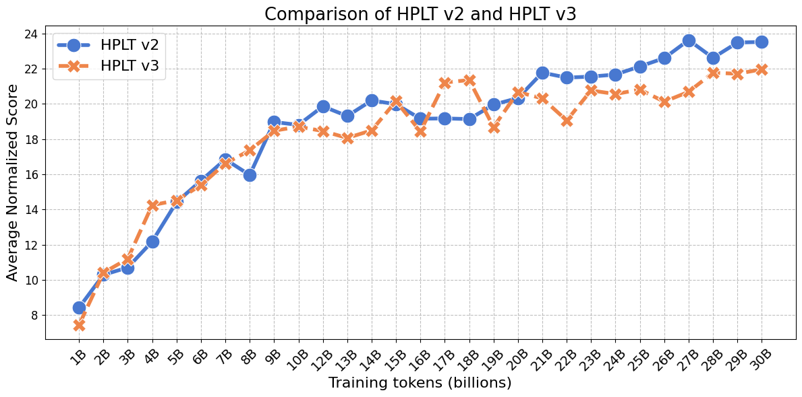
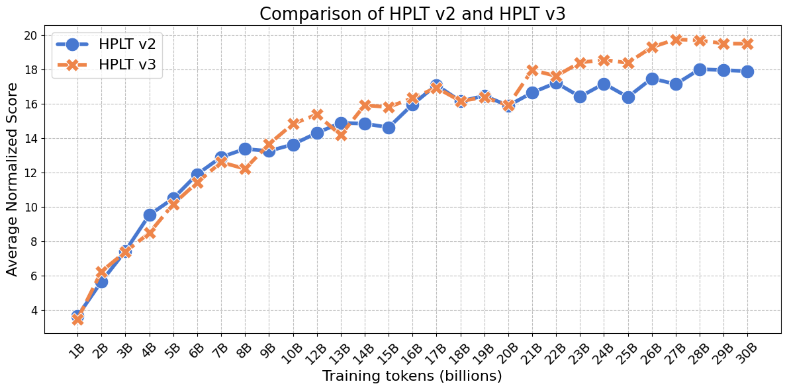
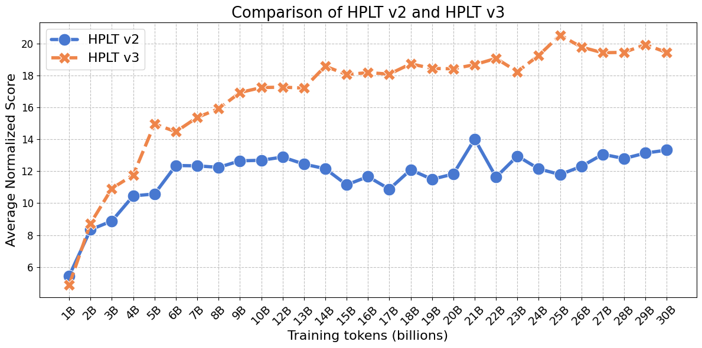
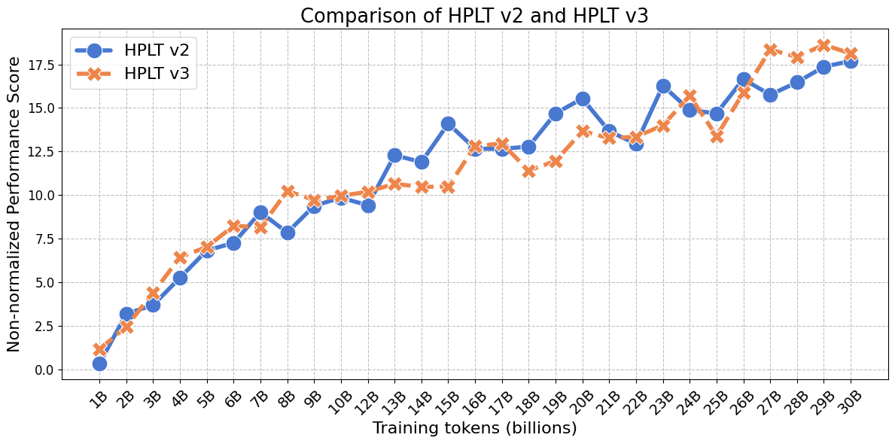
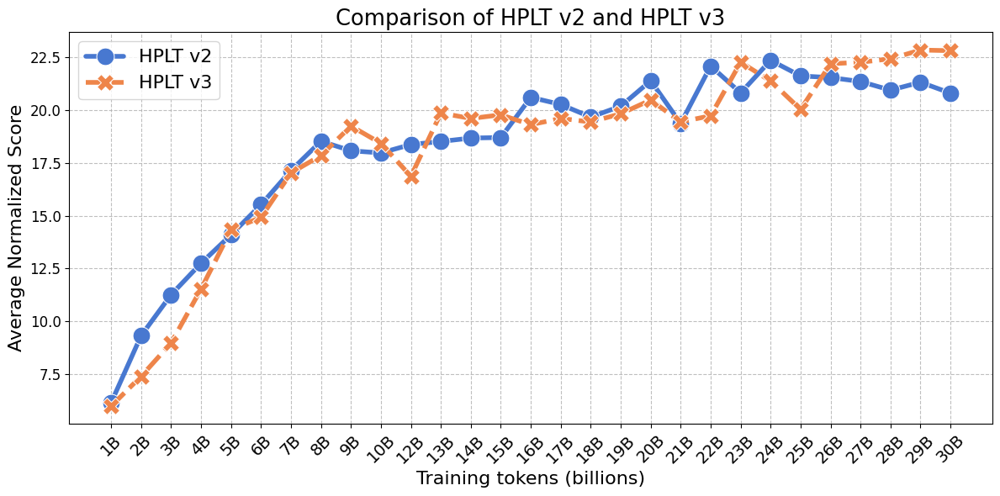
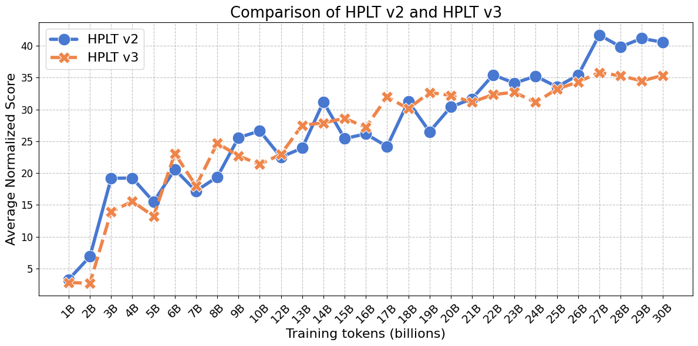
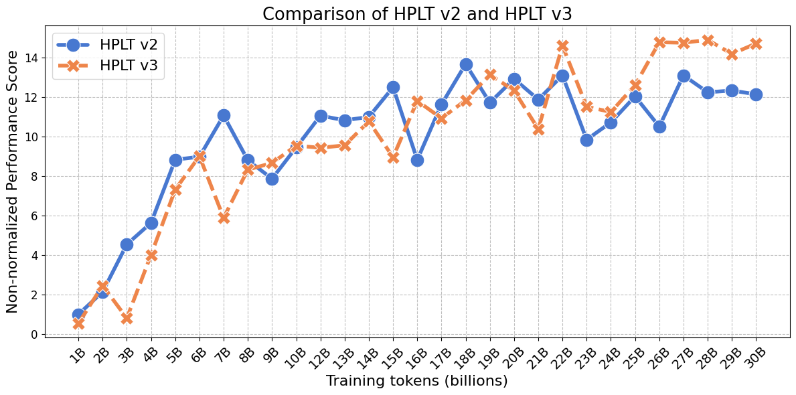
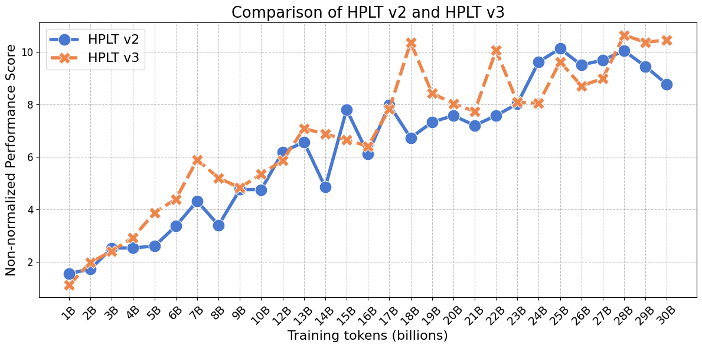
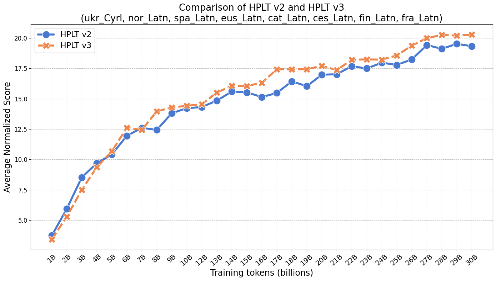
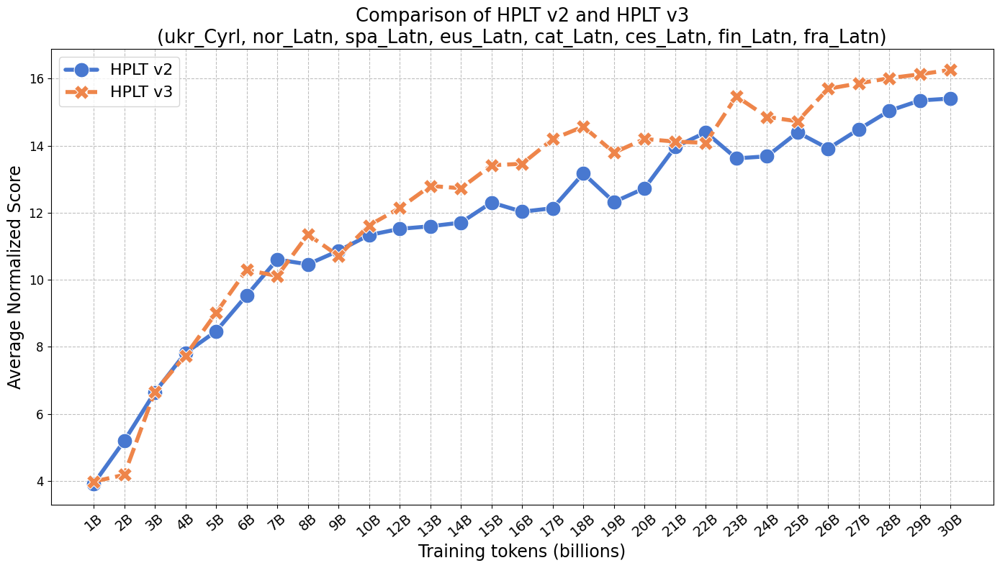

# HPLT-E: Multilingual and Comprehensive LLM Evaluation

HPLT-E is a framework for comprehensive multilingual and multi-prompt *k*-shot evaluation across 124 tasks in eight typologically diverse languages: Catalan, Spanish, Basque, Galician, Norwegian, Ukrainian, Czech, and Finnish.

## Updates

* **`08.10.2025`**: We are releasing HPLT v3 together with HPLT-E, used to benchmark HPLT v3 against HPLT v2 in our multilingual ablation studies.


## Contents
- [Overview](#overview)
- [Evaluation suite](#evaluation-suite)
- [Ablation studies](#ablation-studies)
- [Installation and Usage](#installation-and-usage)


## Overview

HPLT-E combines existing monolingual benchmarks for Catalan (CatalanBench), Spanish (SpanishBench), Basque (BasqueBench), Galician (GalicianBench), Norwegian (NorEval), Finnish (FinBench v2), and Czech (BenCzechMark). In addition, we create a multi-task benchmark for Ukrainian (UkrainianBench) and extend  single-prompt benchmarks to the multi-prompt scenario (Catalan, Spanish, Basque, Galician, and Ukrainian). HPLT-E covers a diverse set of 124 natural language understanding and generation tasks, each supporting 3-7 human-written prompts. Our main evaluation principles include:

* **Diversity**: broader representation of lesser-resourced languages in context of pretraining corpora comparison.
* **Data quality**: use of human-created datasets to ensure reliable evaluation.
* **Robust evaluation**: evaluation across 450+ prompts written by native speakers to account for prompt sensitivity.
* **Reproducibility**: full integration of HPLT-E into [LM Evaluation Harness](https://github.com/EleutherAI/lm-evaluation-harness) for user-friendly standardized evaluation.


## Evaluation suite

### Catalan

* Benchmark: CatalanBench
* Paper: [aclanthology.org/2025.coling-main.699](https://aclanthology.org/2025.coling-main.699)
* Homepage: N/A
* Language code: `cat_Latn`
* Original LM Evaluation Harness implementation: [github.com/EleutherAI/lm-evaluation-harness/tree/main/lm_eval/tasks/catalan_bench](https://github.com/EleutherAI/lm-evaluation-harness/tree/main/lm_eval/tasks/catalan_bench)
* HPLT-E multi-prompt implementation: [cat_Latn](./cat_Latn/)

<details >
<summary><b>Tasks</b></summary>

|Name  |LM Evaluation Harness   |Task type  | Task category |
|:---|:---|:---|:---|
|	ARC-ca	| `arc_ca_challenge_p[0-2]`	|	Multiple-choice QA |	Language-specific & world knowledge |
|	ARC-ca	| `arc_ca_easy_p[0-2]`		|	Multiple-choice QA |	Language-specific & world knowledge |
|	Belebele| 	`catbelebele_p[0-2]`	|Multiple-choice QA |	Reading comprehension |
|	CatalanQA|	`catalanqa_p[0-2]`			 |Generative QA	| Language-specific & world knowledge|
|	CatCoLA|	`catcola_p[0-2]`	|		 Text classification	|Language knowledge|
|	COPA-ca	|`copa_ca_p[0-2]`	|	Text cassification	|Commonsense reasoning|
|	CoQCat	|`coqcat_p[0-2]`	|	 Generative QA	|Reading comprehension|
|	MGSM-cat|	`mgsm_direct_ca_p[0-2]`	|	Generative QA	|Mathematical reasoning|
|	OpenBookQA-cat	|`openbookqa_ca_p[0-2]`	|	Multiple-choice QA |	Language-specific & world knowledge|
|	Parafraseja	|`parafraseja_p[0-2]`	|	Text classification	|Paraphrasing|
|	PAWS-ca	|`paws_ca_p[0-2]`	|	 Text classification	|Paraphrasing|
|	PIQA-ca|	`piqa_ca_p[0-2]`	|		Multiple-choice QA |	Commonsense reasoning|
|	SIQA-ca	|`siqa_ca_p[0-2]`	|		Multiple-choice QA |	Commonsense reasoning|
|	TE-ca	|`teca_p[0-2]`	|	Text classification	|Entailment|
|	VeritasQA-cat Generation	|`veritasqa_ca_gen_p[0-2]`	|	Generative QA|	Truthfulness|
|	VeritasQA-cat Multiple-choice	|`veritasqa_ca_mc1_p[0-2]`	|	Multiple-choice QA |	Truthfulness|
|	VeritasQA-cat Multiple-choice	|`veritasqa_ca_mc2_p[0-2]`	|	Multiple-choice QA |	Truthfulness|
|	WNLI	|`wnli_ca_p[0-2]`	|	Text classification	|Entailment|
|	XNLI	|`xnli_ca_p[0-2]`	|	Text classification	|Entailment|
|	XQuAD	|`xquad_ca_p[0-2]`	|	Generative QA|	Reading comprehension|
|	xStoryCloze	|`xstorycloze_ca_p[0-2]`	|	Multiple-choice QA |	Commonsense reasoning|
|	Cocoteros	|`cocoteros_va_p[0-2]`	|	Text generation	|Commonsense reasoning|
|	FLORES	| `flores_en-ca_p[0-2]`	|	Sequence-to-sequence generation|	Machine translation|

</details>

### Spanish

* Benchmark: SpanishBench
* Paper: [aclanthology.org/2025.coling-main.699](https://aclanthology.org/2025.coling-main.699)
* Homepage: N/A
* Language code: `spa_Latn`
* Original LM Evaluation Harness implementation: [github.com/EleutherAI/lm-evaluation-harness/tree/main/lm_eval/tasks/spanish_bench](https://github.com/EleutherAI/lm-evaluation-harness/tree/main/lm_eval/tasks/spanish_bench)
* HPLT-E multi-prompt implementation: [spa_Latn](./spa_Latn/)

<details >
<summary><b>Tasks</b></summary>

|Name  |LM Evaluation Harness   |Task type  | Task category |
|:---|:---|:---|:---|
|Belebele|	`spabelebele_p[0-2]`	 |Multiple-choice QA	|Reading comprehension|
|COPA|	`copa_es_p[0-2]`		|Text cassification	|Commonsense reasoning|
|ESCoLA	|`escola_p[0-2]`		|Text cassification	|Language knowledge|
|MGSM-es|	`mgsm_direct_es_p[0-2]`	|	Generative QA|	Mathematical reasoning|
|OpenBookQA-es	|`openbookqa_es_p[0-2]`	|	Multiple-choice QA|	Language-specific & world knowledge|
|PAWS-es|	`paws_es_p[0-2]`	|	Text cassification|	Paraphrasing|
|VeritasQA-es Generation	|`veritasqa_es_gen_p[0-2]`	|	Generative QA|	Truthfulness|
|VeritasQA-es Multiple-choice	|`veritasqa_es_mc1_p[0-2]`	|	Multiple-choice QA	|Truthfulness|
|VeritasQA-es Multiple-choice	|`veritasqa_es_mc2_p[0-2]`	|		Multiple-choice QA|	Truthfulness|
|XNLI	| `xnli_es_p[0-2]`	|	Text cassification	| Entailment|
|XQuAD	| `xquad_es_p[0-2]`|		Generative QA	|Reading comprehension|
|xStoryCloze	|`xstorycloze_es_p[0-2]`	|	Multiple-choice QA|	Commonsense reasoning|
|Cocoteros|	`cocoteros_es_p[0-2]`	|		Text generation | 	Commonsense reasoning|
|FLORES	|`flores_en-es_p[0-2]`	| Sequence-to-sequence generation|	Machine translation|
|INCLUDE|	`include_spanish_p[0-2]`		|	Multiple-choice QA	|Language-specific & world knowledge|
|Global-MMLU|	`global_mmlu_spanish_p[0-2]`		|	Multiple-choice QA	|Language-specific & world knowledge|

</details>

### Basque

* Benchmark: BasqueBench
* Paper: [aclanthology.org/2025.coling-main.699](https://aclanthology.org/2025.coling-main.699)
* Homepage: N/A
* Language code: `eus_Latn`
* Original LM Evaluation Harness implementation: [github.com/EleutherAI/lm-evaluation-harness/tree/main/lm_eval/tasks/basque_bench](https://github.com/EleutherAI/lm-evaluation-harness/tree/main/lm_eval/tasks/basque_bench)
* HPLT-E multi-prompt implementation: [eus_Latn](./eus_Latn/)

<details >
<summary><b>Tasks</b></summary>

|Name  |LM Evaluation Harness   | Task type  | Task category |
|:---|:---|:---|:---|
|	Belebele |	`eusbelebele_p[0-2]`	|	 	Multiple-choice QA	|Reading comprehension|
|	EusExams	|`eus_exams_eu_p[0-2]`	|		Multiple-choice QA	|Language-specific & world knowledge|
|	EusProfficiency	|`eus_proficiency_p[0-2]`	|	 Multiple-choice QA	|Language-specific & world knowledge|
|	EusReading|	`eus_reading_p[0-2]`	|	 Multiple-choice QA|	Reading comprehension|
|	EusTrivia	|`eus_trivia_p[0-2]`	|	 Multiple-choice QA|	Language-specific & world knowledge|
|	MGSM-eu	|`mgsm_direct_eu_p[0-2]`	|		Generative QA	|Mathematical reasoning|
|	PIQA-eu	|`piqa_eu_p[0-2]`	|	Multiple-choice QA|	Commonsense reasoning|
|	WNLI	|`wnli_eu_p[0-2]`	|	Text classification|	Entailment|
|	XCOPA	|`xcopa_eu_p[0-2]`	|	Text cassification	|Commonsense reasoning|
|	XNLI	|`xnli_eu_native_p[0-2]`	|	Text classification|	Entailment|
|	xStoryCloze|	`xstorycloze_eu_p[0-2]`	|		Multiple-choice QA|	Commonsense reasoning|
|	PAWS-eu|	`paws_eu_p[0-2]`	|Text classification|	Paraphrasing|
|	ARC-eu|`arc_eu_easy_p[0-2]`	|	 	Multiple-choice QA|	Language-specific & world knowledge|
|	ARC-eu|	`arc_eu_challenge_p[0-2]`	|		Multiple-choice QA|	Language-specific & world knowledge|
|	FLORES	|`flores_en-eu_p[0-2]`	|	Sequence-to-sequence generation|	Machine translation|
|	INCLUDE	|`include_basque_p[0-2]`	|		Multiple-choice QA|	Language-specific & world knowledge|

</details>


### Norwegian

* Benchmark: NorEval
* Paper: [aclanthology.org/2025.findings-acl.181](https://aclanthology.org/2025.findings-acl.181/)
* Homepage: [github.com/ltgoslo/noreval](https://github.com/ltgoslo/noreval/tree/main)
* Language code: `nor_Latn`
* Original LM Evaluation Harness implementation: [github.com/EleutherAI/lm-evaluation-harness/tree/main/lm_eval/tasks/noreval](https://github.com/EleutherAI/lm-evaluation-harness/tree/main/lm_eval/tasks/noreval)
* HPLT-E multi-prompt implementation: N/A


<details >
<summary><b>Tasks</b></summary>

|Name  |LM Evaluation Harness (Bokmål) | LM Evaluation Harness (Nynorsk)  |Task type  | Task category |
|:---|:---|:---|:---|:---|
|[NoReC Sentence](https://huggingface.co/datasets/ltg/norec_sentence) |```norec_sentence_p[0-4]```  | ❌ |Text classification| Sentiment analysis |
|[NoReC Document](https://huggingface.co/datasets/ltg/norec_document) |```norec_document_p[0-4]```  | ❌ |Text classification| Sentiment analysis |
|[NorIdiom](https://huggingface.co/datasets/Sprakbanken/Norwegian_idioms) |```noridiom_nob_p[0-4]```  | ```noridiom_nno_p[0-4]```  | Sentence completion| Language knowledge  |
|[Belebele](https://huggingface.co/datasets/facebook/belebele) |```norbelebele_p[0-4]```| ❌|Multiple-choice QA| Reading comprehension |
|[NRK-Quiz-QA](https://huggingface.co/datasets/ltg/nrk_quiz_qa) |```nrk_quiz_qa_nob_p[0-4]```| ```nrk_quiz_qa_nno_p[0-4]```| Multiple-choice QA| Language-specific & world knowledge |
|[NorOpenBookQA](https://huggingface.co/datasets/ltg/noropenbookqa) |```noropenbookqa_nob_p[0-4]```| ```noropenbookqa_nno_p[0-4]``` |Multiple-choice QA| Language-specific & world knowledge |
|[NorCommonsenseQA](https://huggingface.co/datasets/ltg/norcommonsenseqa) |```norcommonsenseqa_nob_p[0-4]```| ```norcommonsenseqa_nno_p[0-4]``` |Multiple-choice QA|Commonsense reasoning  |
|[NorTruthfulQA Multiple choice](https://huggingface.co/datasets/ltg/nortruthfulqa_mc) |```nortruthfulqa_mc_nob_p[0-4]```| ```nortruthfulqa_mc_nno_p[0-4]``` |Multiple-choice QA |Truthfulness |
|[NorQuAD](https://huggingface.co/datasets/ltg/norquad) |```norquad_p[0-4]```| ❌  | Generative QA |Reading comprehension |
|[NorTruthfulQA Generation](https://huggingface.co/datasets/ltg/nortruthfulqa_gen) |```nortruthfulqa_gen_nob_p[0-4]```| ```nortruthfulqa_gen_nno_p[0-4]``` |  Generative QA|Truthfulness |
|[Tatoeba (English → Bokmål/Nynorsk)](https://huggingface.co/datasets/Helsinki-NLP/tatoeba_mt) | ```tatoeba_eng_nob_p[0-4]```| ```tatoeba_eng_nno_p[0-4]```  |Sequence-to-sequence generation|Machine translation |

</details>


### Ukrainian

* Benchmark: UkrainianBench
* Paper: N/A
* Homepage: [github.com/hplt-project/hplt-e](https://github.com/hplt-project/hplt-e)
* Language code: `ukr_Cyrl`
* Original LM Evaluation Harness implementation: N/A 
* HPLT-E multi-prompt implementation: [ukr_Cyrl](./ukr_Cyrl/)


<details >
<summary><b>Tasks</b></summary>

|Name  |LM Evaluation Harness   |Task type  | Task category |
|:---|:---|:---|:---|
|[Global-MMLU](https://huggingface.co/datasets/CohereForAI/Global-MMLU)| `global_mmlu_ukrainian_p[0-2]` | Multiple-choice QA | Language-specific & world knowledge |
|[ZNO](https://huggingface.co/datasets/osyvokon/zno)| `zno_p[0-2]` |  Multiple-choice QA | Language-specific & world knowledge |
|[INCLUDE](https://huggingface.co/datasets/CohereLabs/include-base-44)| `include_ukrainian_p[0-2]` |  Multiple-choice QA | Language-specific & world knowledge |
|[TextDetox](https://huggingface.co/datasets/ukr-detect/ukr-toxicity-dataset)| `textdetox_ukr_p[0-2]` | Text classification | Toxicity detection | 
|[UA-SQuAD](https://huggingface.co/datasets/HPLT/ua-squad) | `ua_squad_p[0-2]` |  Generative QA | Reading comprehension |
|[Belebele](https://huggingface.co/datasets/facebook/belebele) | `ukrbelebele_p[0-2]` |  Multiple-choice QA | Reading comprehension |
|[WMT24PP](https://huggingface.co/datasets/google/wmt24pp/) | `wmt24pp_en-uk_p[0-2]` |  Sequence-to-sequence generation	| Machine translation|

</details>

### Czech

* Benchmark: BenCzechMark
* Paper: [arxiv.org/abs/2412.17933](https://arxiv.org/abs/2412.17933)
* Homepage: [github.com/DCGM/lm-evaluation-harness](https://github.com/DCGM/lm-evaluation-harness)
* Language code: `ces_Latn`
* Original LM Evaluation Harness implementation: [github.com/DCGM/lm-evaluation-harness/tree/main/lm_eval/tasks/benczechmark](https://github.com/DCGM/lm-evaluation-harness/tree/main/lm_eval/tasks/benczechmark)
* HPLT-E multi-prompt implementation: [ces_Latn](./ces_Latn/)


**NB**: we update BenCzechmark to enable support for latest LM Evaluation Harness versions and create prompts for Global-MMLU

<details >
<summary><b>Tasks</b></summary>

|Name  |LM Evaluation Harness   |Task type  | Task category |
|:---|:---|:---|:---|
 |	Belebele	|`cesbelebele_p[0-4]`	 |	 Multiple-choice QA  | 	Reading comprehension |
 |	Global-MMLU|	`global_mmlu_czech_p[0-4]`	 |		Multiple-choice QA  | 	Language-specific & world knowledge |
 |	SQAD3.2	|`cs_sqad32_p[0-4]`	 |	Generative QA	| Reading comprehension| 
 |	Umimeto 	|`umimeto_p[0-4]`	 |	Multiple-choice QA  | 	Language-specific & world knowledge| 
 |	CERMAT OPEN	|`cermat_czech_open_p[0-4]`	 |	Generative QA |	Language knowledge|
 |	CERMAT TF	|`cermat_czech_tf_p[0-4]`	 |	Multiple-choice QA  | 	Language knowledge|
 |	CERMAT MC	|`cermat_czech_mc_p[0-4]`	 |	Multiple-choice QA  | 	Language knowledge|
 |	Klokan QA |	`klokan_qa_p[0-4]`	 |	Multiple-choice QA  | 	Mathematical reasoning|
 |	CERMAT (Math) MC |	`cermat_czmath_mc_p[0-4]`	 |	Multiple-choice QA  | 	Mathematical reasoning|
  |	CERMAT (Math) OPEN|	`cermat_czmath_open_p[0-4]`	 |	Generative QA  | 	Mathematical reasoning|
 |	CTKFacts 	| `ctkfacts_nli_p[0-4]`	 |		Text classification | 	Entailment|
 |	Subjectivity 	|`ces_subjectivity_p[0-4]`	 |	Text classification | 	Sentiment analysis|
 |	CzechSentiment - Mall	|`sentiment_mall_p[0-4]`	 |		Text classification | 	Sentiment analysis|
 |	CzechSentiment - CSFD |	`sentiment_csfd_p[0-4]`	 |		Text classification | 	Sentiment analysis|
 |	CzechSentiment - FB |	`sentiment_fb_p[0-4]`	 |	Text classification | 	Sentiment analysis|

</details>

### French

* Benchmark: FrenchBench
* Paper: [arxiv.org/abs/2402.00786](https://arxiv.org/abs/2402.00786)
* Homepage: [huggingface.co/croissantllm](https://huggingface.co/croissantllm)
* Language code: `fra_Latn`
* Original LM Evaluation Harness implementation: [github.com/EleutherAI/lm-evaluation-harness/tree/main/lm_eval/tasks/french_bench](https://github.com/EleutherAI/lm-evaluation-harness/tree/main/lm_eval/tasks/french_bench)
* HPLT-E multi-prompt implementation: [fra_Latn](./fra_Latn/)

<details >
<summary><b>Tasks</b></summary>

|Name  |LM Evaluation Harness   |Task type  | Task category |
|:---|:---|:---|:---|
|	FQuaD	|`fquad_p[0-2]`	|					Generative QA|	Reading comprehension|
|	French Language Test: Grammar	|`french_bench_grammar_p[0-2]`	|					Multiple-choice QA|	Language knowledge|
|	French Language Test: Vocabulary|	`french_bench_vocabulary_p[0-2]`	|					Multiple-choice QA|	Language knowledge|
|	French Language Test: Reading	|`french_bench_reading_p[0-2]`	|					Multiple-choice QA|	Reading comprehension|
|	Belebele	|`frabelebele_p[0-2]`	|					Multiple-choice QA|	Reading comprehension|
|	French NLI|	`topic_based_nli_p[0-2]`	|					Text classification|	Entailment|
|	XNLI	|`french_xnli_p[0-2]`	|					Text classification	|Entailment|
|	INCLUDE	|`include_french_p[0-2]`	|	 Multiple-choice QA|	Language-specific & world knowledge|
|	Global-MMLU	| `global_mmlu_french_p[0-2]`	|		Multiple-choice QA|	Language-specific & world knowledge|

</details>

### Finnish

* Benchmark: FinBench v2
* Paper: TBA
* Homepage: N/A
* Language code: `fin_Latn`
* Original LM Evaluation Harness implementation: [github.com/LumiOpen/lm-evaluation-harness/tree/finbench_v2/lm_eval/tasks/finbench_v2](https://github.com/LumiOpen/lm-evaluation-harness/tree/finbench_v2/lm_eval/tasks/finbench_v2)
* HPLT-E multi-prompt implementation: N/A
<details >
<summary><b>Tasks</b></summary>

| Name| Formulation | LM Evaluation Harness| Task type | Task category| FinBench v2 dataset version |
|:--------------------|-------------|:|:----------------|:----|:------------------|
| [ARC-challenge-fi](https://huggingface.co/datasets/silogen/ARC-C-fi-HT) | _mcf_ | `arc_challenge_fi_mcf_fbv2_p[0-4]` | Multiple-choice QA | Language-scpecific & world knowledge | [finbenchv2-arc-c-fi-ht](https://huggingface.co/datasets/TurkuNLP/finbenchv2-arc-c-fi-ht)  |
|     | _cf_  | `arc_challenge_fi_cf_fbv2_p[0-4]`  ||  |      |    |
| [Belebele](https://huggingface.co/datasets/facebook/belebele)   | _mcf_ | `belebele_fin_Latn_mcf_fbv2_p[0-4]`| Multiple-choice QA | Reading comprehension | [finbenchv2-belebele-fi-og](https://huggingface.co/datasets/TurkuNLP/finbenchv2-belebele-fi-og)  |
|     | _cf_  | `belebele_fin_Latn_cf_fbv2_p[0-4]` ||  |      |    |
| [GoldenSwag](https://huggingface.co/datasets/PleIAs/GoldenSwag) | _mcf_ | `goldenswag_ht_fi_mcf_fbv2_p[0-4]`  | Sentence completion  | Commonsense reasoning | [finbenchv2-goldenswag-fi-ht](https://huggingface.co/datasets/TurkuNLP/finbenchv2-goldenswag-fi-ht)      |
|     | _cf_  | `goldenswag_ht_fi_cf_fbv2_p[0-4]`  ||  |      |    |
| [FIN-Bench](https://github.com/TurkuNLP/FIN-bench)     | _mcf_ | `finbench_analogies_mcf_fbv2_p[0-4]`   | Multiple-choice   | Relational reasoning  | [FIN-bench](https://huggingface.co/datasets/TurkuNLP/FIN-bench)  |
|     | _cf_  | `finbench_analogies_cf_fbv2_p[0-4]`||  |      |    |
|     | _mcf_ | `finbench_emotions_mcf_fbv2_p[0-4]` | Multiple-choice   | Sentiment analysis    | [FIN-bench](https://huggingface.co/datasets/TurkuNLP/FIN-bench)  |
|     | _cf_  | `finbench_emotions_cf_fbv2_p[0-4]` ||  |      |    |
|     | _mcf_ | `finbench_empirical_judgments_mcf_fbv2_p[0-4]` | Multiple-choice   | Causal reasoning      | [FIN-bench](https://huggingface.co/datasets/TurkuNLP/FIN-bench)  |
|     | _cf_  | `finbench_empirical_judgments_cf_fbv2_p[0-4]` ||  |      |    |
|     | _mcf_ | `finbench_general_knowledge_mcf_fbv2_p[0-4]` | Multiple-choice   | Language-scpecific & world knowledge | [FIN-bench](https://huggingface.co/datasets/TurkuNLP/FIN-bench)  |
|     | _cf_  | `finbench_general_knowledge_cf_fbv2_p[0-4]` ||  |      |    |
|     | _mcf_ | `finbench_hhh_alignment_mcf_fbv2_p[0-4]`     | Multiple-choice   | Alignment and safety  | [FIN-bench](https://huggingface.co/datasets/TurkuNLP/FIN-bench)  |
|     | _cf_  | `finbench_hhh_alignment_cf_fbv2_p[0-4]`     ||  |      |    |
|     | _mcf_ | `finbench_paraphrase_mcf_fbv2_p[0-4]`  | Multiple-choice   | Paraphrasing     | [FIN-bench](https://huggingface.co/datasets/TurkuNLP/FIN-bench)  |
|     | _cf_  | `finbench_paraphrase_cf_fbv2_p[0-4]`  ||  |      |    |
|     | _mcf_ | `finbench_similarities_abstraction_mcf_fbv2_p[0-4]`  | Multiple-choice   | Commonsense reasoning | [FIN-bench](https://huggingface.co/datasets/TurkuNLP/FIN-bench)  |
|     | _cf_  | `finbench_similarities_abstraction_cf_fbv2_p[0-4]`  ||  |      |    |


</details>

## Ablation studies

In our HPLT v3 release, we conduct a series of multilingual ablation studies to compare HPLT v2 and HPLT v3 on the eight HPLT-E languages. We pretrain monolingual Llama-style 2.15B decoder-only models using 30B tokens from each language corpus, keeping the hyperparameters and tokenizer fixed across experiments:
- Hidden size: 2048
- Attention heads: 32
- Layers: 24
- Sequence length: 2048
- Tokenizer: Gemma-3 (SentencePiece, vocabulary size 262K)

Pretraining is performed with the Megatron-LM framework on the LUMI HPC supercomputer, using 16 AMD MI250x nodes and totaling approx. 1k GPU hours. We evaluate the ablation models at regular checkpoint intervals (every 1B tokens) in a 0-shot setup, aggregating results across all prompts and selecting tasks that provide reliable signal during pretraining.

### Task selection

We use the standard task-specific metrics and report the maximum score across the prompts as the main performance aggregation method. We adapt [the FineWeb2 evaluation design](https://huggingface.co/spaces/HuggingFaceFW/blogpost-fine-tasks) to examine the signal HPLT-E tasks provide based on the criteria and statistics summarized below.

| Criterion | Scope    | Description | Requirement      |
| :---- | :---| :--- | :--- |
| **Prompt-level median absolute deviation (MAD)** | Mid-late pretraining window (15B-30B) | Typical prompt sensitivity | ≤ 5 |
| **Consistency (Kendall τ)** | Mid-late pretraining window (15B-30B)  | Stability of corpus rankings across pretraining intervals  | No strict threshold |
| **Trajectory-level coefficient of variation (CV)**     | Mid-late pretraining window (15B-30B)  | Relative variation around upper-bound performance  | ≤ 10-12% |
| **Prompt-switch rate (%)** | Mid-late pretraining window (15B-30B)  | Measures best prompt consistency across checkpoints (prompt lottery) | No strict threshold |
| **Spread**      |  Final checkpoint (30B) | The absolute difference between the maximum and minimum scores across prompts | No strict threshold |
| **Signal-to-noise ratio (SNR)** |  Final checkpoint (30B) | Noise from prompt variability | ≥ 3 |
| **Non-randomness**      |  Final checkpoint (30B) | The absolute difference between the final score and random baseline  | Must be positive and satisfactory   |
| **Monotonicity (Spearman correlation)**     | All checkpoints (1B-30B)  | Correlation between step and performance score  | ≥ 0.5 |

### Language-level performance aggregation

#### Computing a language score

To compute a language-level score across the selected tasks, we:

1. Rescale performance scores relative to a random baseline using min–max normalization.
2. Average the normalized scores within each task category.
3. Compute the final language score as the mean of these category averages.

Results for all languages are presented below.

<details>
  <summary><b>Spanish</b></summary>

  
</details>

<details>
  <summary><b>Catalan</b></summary>

  
</details>

<details>
  <summary><b>Basque</b></summary>

  
</details>

<details>
  <summary><b>Czech</b></summary>

  
</details>

<details>
  <summary><b>Finnish</b></summary>

  
</details>

<details>
  <summary><b>Norwegian</b></summary>

  
</details>

<details>
  <summary><b>Ukrainian</b></summary>

  
</details>

<details>
  <summary><b>French</b></summary>

  
</details>

#### Computing a "multilingual" score

To compute the multilingual score, we utilize several approaches:

1. **Average normalized score**: We average min-max normalized language scores.
2. **Average rank**: we rank the 30B models’ language scores across all corpora configurations and average their ranks.
3. **Borda count**: first, we rank the 30B models for each language; second, we apply the Borda count on the language-wise rankings to compute the final ranking. We utilize the [Vote'n'Rank](https://aclanthology.org/2023.eacl-main.48/) framework.


<details>
  <summary><b>Average normalized score (max. as prompt-level aggregation)</b></summary>

  
</details>

<details>
  <summary><b>Average normalized score (median as prompt-level aggregation)</b></summary>

  
</details>

<details >
<summary><b>Rank-based aggregation</b></summary>

|Corpus  |Avg. rank  |Borda count  |
|:---|:---|:---|
|	HPLT v3	| 1.25	|	5|
|	HPLT v2 | 1.75	|	2|

</details>


### Key Takeaways

Our preliminary pretraining corpus comparison shows that LLMs pretrained on HPLT v3 consistently outperform HPLT v2 across the HPLT-E languages. In particular, v3 models achieve stronger results for Ukrainian, Basque, Catalan, and French, perform on par with v2 for Finnish and Czech, and show minor decreases for Spanish and Norwegian.

Stay tuned for more evaluation and methodological updates 💥


## Installation and usage

1. Install LM Evaluation Harness as described [here](https://github.com/EleutherAI/lm-evaluation-harness?tab=readme-ov-file#install).

```bash
git clone --depth 1 https://github.com/EleutherAI/lm-evaluation-harness
cd lm-evaluation-harness
pip install -e .
```

2. Clone our HPLT-E GitHub repository to get access to the multi-prompt versions of SpanishBench, CatalanBench, BasqueBench, BenCzechMark, FrenchBench, and UkrainianBench.

```bash
git clone https://github.com/hplt-project/hplt-e.git
```

3. Get the `finbench_v2` folder from [the FinBench v2 GitHub repository](https://github.com/LumiOpen/lm-evaluation-harness/tree/finbench_v2/lm_eval/tasks/finbench_v2)


### Examples

Detailed guidelines on how to use LM Evaluation Harness can be found [here](https://github.com/EleutherAI/lm-evaluation-harness/blob/main/docs/interface.md). The task names can be found in the **LM Evaluation Harness** column in the language-specific task tables provided above. `_p[i-j]` stands for the corresponding supported prompts.

#### Basic usage

Below is an example of a basic framework usage and must-have arguments. The evaluation requires the usage of the `include_path` argument to ensure our tasks are registered in the framework:

```bash
lm_eval \
  --model hf \
  --model_args pretrained=my_hf_model_name \
  --tasks global_mmlu_ukrainian_p0 \
  --include_path hplt-e/
  --output results/ukrainian/ \
  --log_samples \
  --show_config \
  --write_out \
  --batch_size auto \
  --num_fewshot 0
```
</details>


#### Task groups

An alternative approach to run all tasks of interest at once involves creating a task group. LM Evaluation Harness allows to group tasks as described [here](https://github.com/EleutherAI/lm-evaluation-harness/blob/main/docs/task_guide.md#group-configuration). An example for the Ukrainian `global_mmlu_ukrainian_p0` group task can be found [here](ukr_Cyrl/global_mmlu/global_mmlu_ukrainian_p0.yaml).
</details>


## Acknowledgements

We thank Étienne Simon (UiO), Lucas Georges Gabriel Charpentier (UiO), and Daryna Dementieva (TUM) for their contribution to our prompt collection for French and Ukrainian.