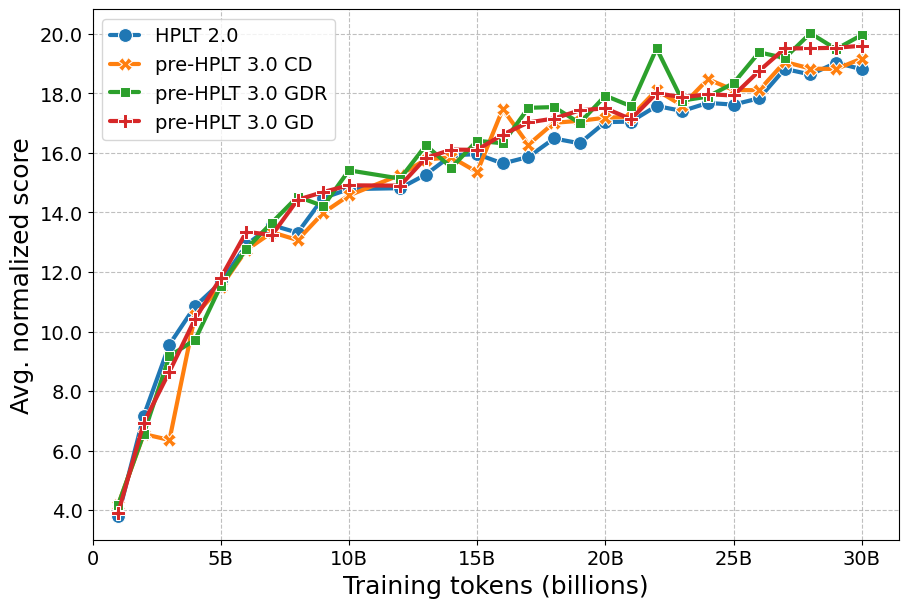
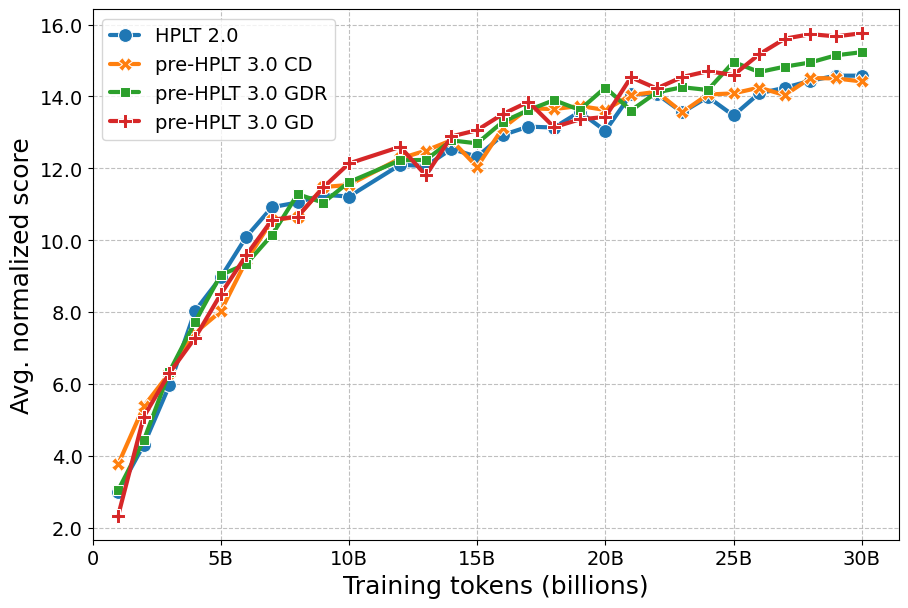
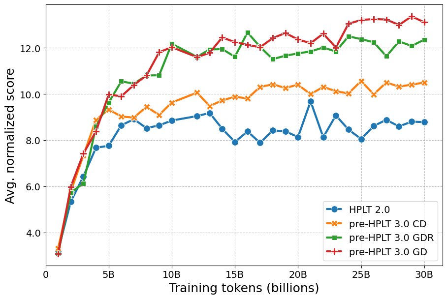
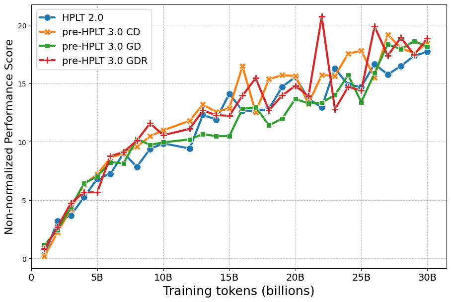
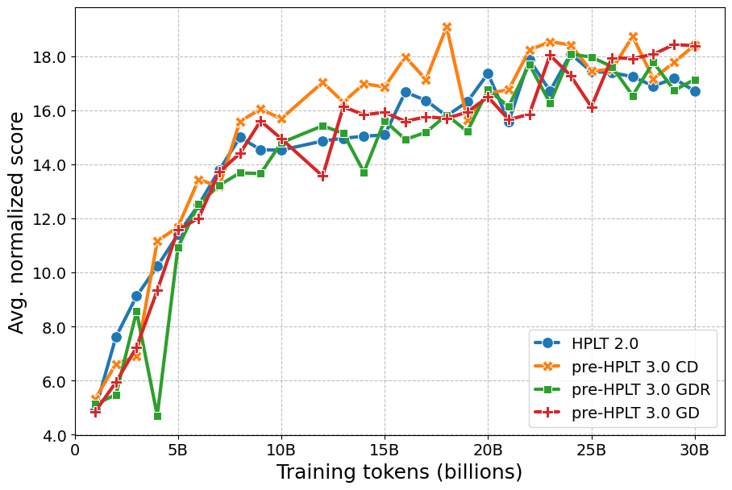
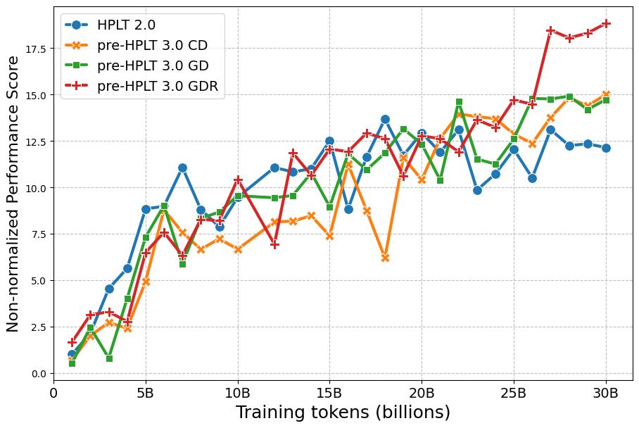

# ⚖️ Pre-HPLT 3.0 Comparison

* **Models:** [hf.co/collections/HPLT/2505-deduplication](https://huggingface.co/collections/HPLT/2505-deduplication)
* **Evals:** [hf.co/datasets/HPLT/2505-deduplication-evals](https://huggingface.co/datasets/HPLT/2505-deduplication-evals)

We present results from our HPLT 3.0 pre-release evaluations comparing different data deduplication stategies for the pre-HPLT 3.0 corpora with the previous HPLT 2.0 version. We pretrain and evaluate decoder-only models on 30B tokens for each language as described [here](../../README.md) (see **Pretraining**, **Task selection**, and **Performance aggregation**).

We compare the following data deduplication strategies to guide our design choices, and guard against data quality regression compared to HPLT 2.0:

* **pre-HPLT 3.0 CD**: per-crawl deduplication.
* **pre-HPLT 3.0 GD**: global deduplication.
* **pre-HPLT 3.0 GDR**: global deduplication & rehydration.


## 🎯 Task selection

| **Criterion**   | **Pretraining Window**    | **Description**   | **Requirement**      |
|---|---|---|---|
| **Monotonicity** | All checkpoints (1B-30B) | Spearman correlation between step and performance score   | ≥ 0.5     |
| **Stable pretraining**      | Mid–late (15B–30B) | Trajectory-level coefficient of variation      | ≤ 12      |
| **Ranking consistency**     | Mid–late (15B–30B) | Kendall’s Tau correlation between rankings at consecutive pretraining intervals   | No strict threshold  |
| **Prompt sensitivity**      | Mid–late (15B–30B) | Median absolute deviation across prompts| ≤ 5|
| **Prompt-switch rate**      | Mid–late (15B–30B) | Best-performing prompt consistency across checkpoints (*prompt lottery*) | No strict threshold  |
| **Signal-to-noise ratio** | Final checkpoint (30B)   | Noise from prompt variation   | ≥ 3|
| **Non-randomness**   | Final checkpoint (30B)   | Absolute difference between the maximum score across final checkpoints and the random baseline  | Must be positive and satisfactory   |

The task criteria results for each language can be found [here](./criteria).

## 🧾 Results

### 🌍 Multilingual score

<summary><b>Average normalized score</b></summary>

<p align="left">
  
</p>


<summary><b>Rank-based aggregation</b></summary>


|Corpus  |Avg. rank  |Borda count  |
|:---|:---|:---|
|	 HPLT 2.0 | 🏅 3.37	|	🏅 5|
|	 pre-HPLT 3.0 CD	| 🥉 2.50	|	🥉 10|
|	 pre-HPLT 3.0 GD	| 🥈 2.25	|	🥈 11|
|	 pre-HPLT 3.0 GDR | 🥇 1.87	|	🥇 18|

### 🔤 Language scores

Please find an example for how to load evals results for particular language below.

```python
from datasets import load_dataset

dataset = load_dataset("HPLT/2505-deduplication-evals", "spa_Latn", split="results").to_pandas()
```

<details>
  <summary><b>Spanish</b></summary>

  
</details>

<details>
  <summary><b>Catalan</b></summary>

  
</details>

<details>
  <summary><b>Basque</b></summary>

  
</details>

<details>
  <summary><b>Czech</b></summary>

  
</details>

<details>
  <summary><b>Finnish</b></summary>

  
</details>

<details>
  <summary><b>Norwegian</b></summary>

  
</details>

<details>
  <summary><b>Ukrainian</b></summary>

  
</details>

<details>
  <summary><b>French</b></summary>

  
</details>


## 🧮 Key takeaways

In this ablation study, we analyze over 50,000 performance scores and report the results across 32 selected tasks. Our pre-release pretraining corpus comparison shows that LLMs pretrained on HPLT 3.0 consistently outperform those pretrained on HPLT 2.0 across the HPLT-E languages. In particular, HPLT 3.0 models achieve stronger results for Ukrainian, Basque, Catalan, Finnish, and French, perform comparably for Czech, and show decreases for Spanish and Norwegian.

We also observe that no tasks for Galician meet the task selection criteria. For Ukrainian, Czech, and French, only a single SQuAD-style task is selected. These are included due to their generative nature, even though they slightly violate the **Stable pretraining** criterion, which reflects the smoothness of pretraining trajectories.

Overall, the results indicate that global deduplication (**pre-HPLT 3.0 GD**) and rehydration (**pre-HPLT 3.0 GDR**) provide the strongest performance gains, with language-specific variation. Based on these results, we adopt global deduplication as our default design decision, and provide the user with the opportunity to obtain the rehydrated version of our HPLT 3.0 corpora.