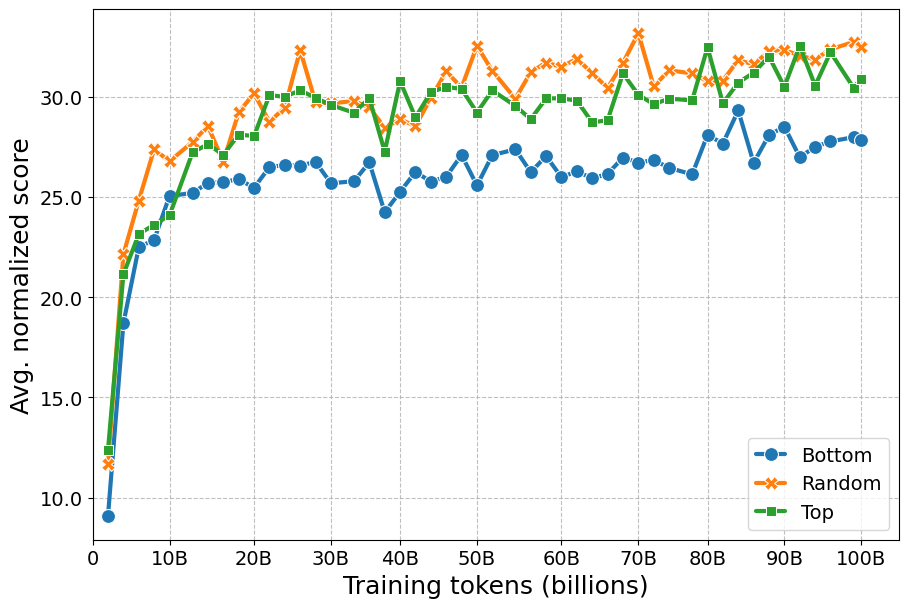

# 🧰 Web Document Scorer (WDS) Comparison

* **Models:** [hf.co/collections/HPLT/2508-wds](https://huggingface.co/collections/HPLT/2508-wds)
* **Evals:** [hf.co/datasets/HPLT/2508-wds-evals](https://huggingface.co/datasets/HPLT/2508-wds-evals)

We present results from our HPLT 3.0 release evaluations comparing the new HPLT 3.0 corpora sampled using different WDS thresholds, focusing on Spanish and French. We pretrain and evaluate decoder-only models on 100B tokens for each language as described [here](../../README.md) (see **Pretraining**, **Task selection**, and **Performance aggregation**).

## 🎯 Task selection

| **Criterion**   | **Pretraining Window**    | **Description**   | **Requirement**      |
|---|---|---|---|
| **Monotonicity** | Mid–late (15B–80B) | Spearman correlation between step and performance score   | ≥ 0.5     |
| **Stable pretraining**      | Mid–late (15B–80B) | Trajectory-level coefficient of variation      | ≤ 15      |
| **Ranking consistency**     | Mid–late (15B–80B) | Kendall’s Tau correlation between rankings at consecutive pretraining intervals   | No strict threshold  |
| **Prompt sensitivity**      | Mid–late (15B–80B) | Median absolute deviation across prompts| ≤ 5|
| **Prompt-switch rate**      | Late (40B–80B) | Best-performing prompt consistency across checkpoints (*prompt lottery*) | No strict threshold  |
| **Signal-to-noise ratio** | Final (80B–100B)   | Noise from prompt variation   | ≥ 3|
| **Non-randomness**   | Final (80B–100B)   | Absolute difference between the maximum score across final checkpoints and the random baseline  | Must be positive and satisfactory   |

The task criteria results for each language can be found [here](./criteria).

## 🧾 Results

### 🌍 Multilingual score

<summary><b>Average normalized score</b></summary>

<p align="left">
  
</p>


<summary><b>Rank-based aggregation</b></summary>

|Corpus  |Avg. rank  |Borda count  |
|:---|:---|:---|
|	 Top	| 🥇 1.5	|	🥈 3|
|	 Random | 🥇 1.5	|	🥇 2|
|	 Bottom | 🥈 3.0	|	🥉 0|

### 🔤 Language scores

Please find an example for how to load evals results for particular language below.

```python
from datasets import load_dataset

dataset = load_dataset("HPLT/2508-wds-evals", "spa_Latn", split="results").to_pandas()
```

<details>
  <summary><b>Spanish</b></summary>

  
</details>


<details>
  <summary><b>French</b></summary>

  
</details>


## 🧮 Key takeaways

In this ablation study, we analyze over 10,500 performance scores and report the results across 6 selected tasks. Here, **Random** sampling represents the default approach, drawing uniformly on the full corpus, while **Top** and **Bottom** take advantage of the sorting by WDS levels and sequentially draw 100B training tokens from either end of the corpus. Low WDS levels clearly lead to inferior model performance, while sampling from only the **Top** does not clearly improve over the full corpus, possibly owing to overly limited diversity. 
