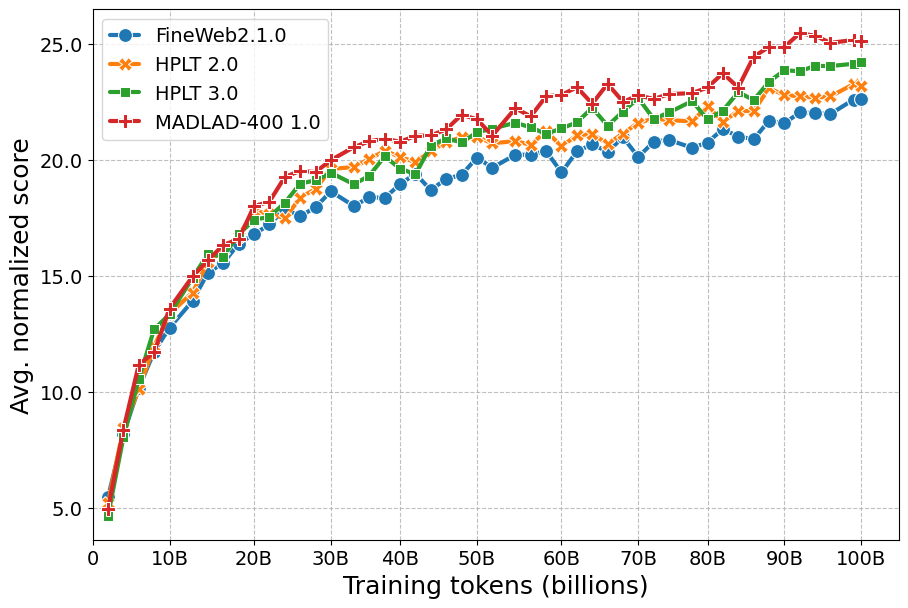
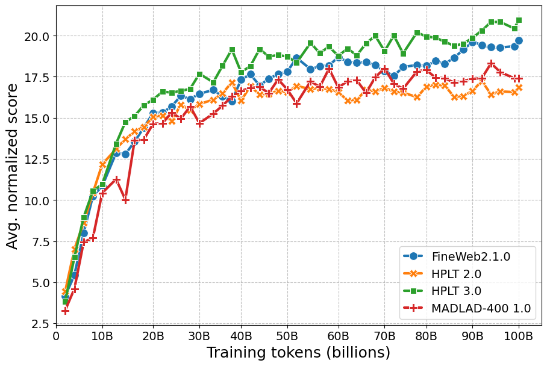
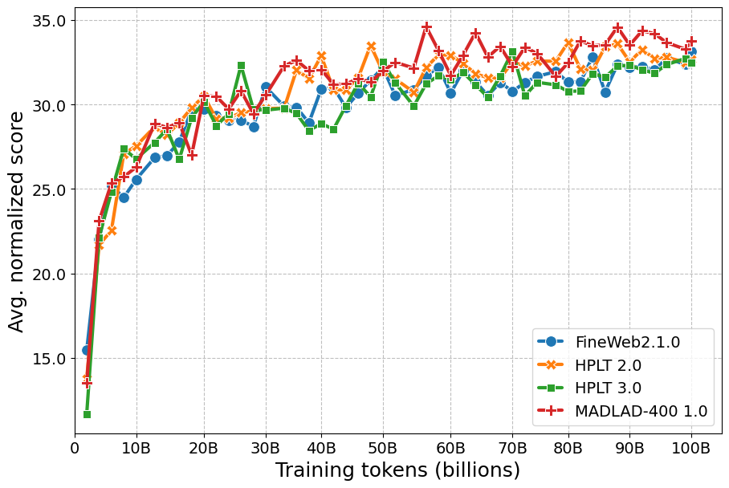

# 📚 Corpora comparison

We present results from our HPLT 3.0 release evaluations comparing the new HPLT 3.0 corpora with the previous HPLT 2.0 version, FineWeb2, and MADLAD-400. We pretrain and evaluate decoder-only models on 100B tokens for each language as described [here](../../README.md) (see **Pretraining**, **Task selection**, and **Performance aggregation**).

## 🎯 Task selection

| **Criterion**   | **Pretraining Window**    | **Description**   | **Requirement**      |
|---|---|---|---|
| **Monotonicity** | Mid–late (15B–80B) | Spearman correlation between step and performance score   | ≥ 0.5     |
| **Stable pretraining**      | Mid–late (15B–80B) | Trajectory-level coefficient of variation      | ≤ 15      |
| **Ranking consistency**     | Mid–late (15B–80B) | Kendall’s Tau correlation between rankings at consecutive pretraining intervals   | No strict threshold  |
| **Prompt sensitivity**      | Mid–late (15B–80B) | Median absolute deviation across prompts| ≤ 5|
| **Prompt-switch rate**      | Late (40B–80B) | Best-performing prompt consistency across checkpoints (*prompt lottery*) | No strict threshold  |
| **Signal-to-noise ratio** | Final (80B–100B)   | Noise from prompt variation   | ≥ 3|
| **Non-randomness**   | Final (80B–100B)   | Absolute difference between the maximum score across final checkpoints and the random baseline  | Must be positive and satisfactory   |

The task selection results for each language can be found [here](./criteria).

## 🧾 Results

### 🌍 Multilingual score

<summary><b>Average normalized score</b></summary>

<p align="left">
  
</p>

<summary><b>Rank-based aggregation</b></summary>

|Corpus  |Avg. rank  |Borda count  |
|:---|:---|:---|
|	 HPLT 3.0	| 🥈 2.43	|	🥉 8|
|	 HPLT 2.0 | 🏅 3.28	|	🏅 3|
|	 MADLAD-400	| 🥇 1.71	|	🥇 15|
|	 FineWeb2	| 🥉 2.57	|	🥈 9|

### 🔤 Language scores

We publish our evaluation results for each language at [hf.co/datasets/HPLT/corpora-comparison-evals](https://huggingface.co/datasets/HPLT/corpora-comparison-evals). See an example below.

```python
from datasets import load_dataset

dataset = load_dataset("HPLT/corpora-comparison-evals", "spa_Latn", split="results").to_pandas()
```

<details>
  <summary><b>Spanish</b></summary>

  
</details>

<details>
  <summary><b>Catalan</b></summary>

  
</details>


<details>
  <summary><b>Czech</b></summary>

  
</details>

<details>
  <summary><b>Finnish</b></summary>

  
</details>

<details>
  <summary><b>Norwegian</b></summary>

  
</details>

<details>
  <summary><b>Ukrainian</b></summary>

  
</details>

<details>
  <summary><b>French</b></summary>

  
</details>


## 🧮 Key takeaways

In this ablation study, we analyze over 96,000 performance scores. We find that tasks for lesser-resourced languages, notably Basque and Galician, are unsuitable for pretraining evaluation due to potential difficulty, evaluation data quality, and lack of monotonic performance progression during pretraining. We thus report our key findings on a final suite of 26 selected tasks across seven remaining languages.

All models show a monotonic performance improvement on our selected tasks as pretraining progresses. Models pretrained on MADLAD-400 achieve the highest multilingual score, followed by HPLT 3.0, while HPLT 2.0 and FineWeb perform on par. These results are consistent with rank-based aggregation. Models are ranked as (1) MADLAD-400; (2) HPLT 3.0; and (3) HPLT 2.0 and FineWeb2; by average multilingual ranks, HPLT 2.0 slightly outperforms FineWeb2, whereas Borda's counts show the inverse ordering. Overall, our findings indicate that refined data preparation in HPLT 3.0 has improved average dataset quality, which translates into competitive performance gains for model pretraining.
